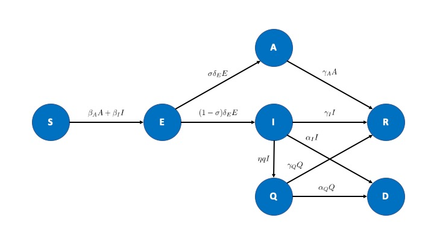

The set of equations are:  

$$\dot S=-\beta_AA-\beta_II$$
$$\dot E=\beta_AA+\beta_II-\delta_EE$$
$$\dot A=\sigma\delta_EE-\gamma_AA$$
$$\dot I=(1-\sigma)\delta_EE-\gamma_II-\alpha_II- \eta qI $$
$$\dot Q=\eta qI-\gamma_QQ-\alpha_QQ$$
$$\dot R=\gamma_II+\gamma_AA+\gamma_QQ$$
$$\dot D=\alpha_II+\alpha_QQ$$

With the compartments $\dot S$, susceptibles, $\dot E$, exposed (latent), $\dot A$, infectious-asymptomatic, $\dot I$, infectious-symptomatic, $\dot Q$, quarantined, $\dot R$, recovered, $\dot D$, dead.  

The parameters are:  

Transmission rate- $\beta_A$ (asymptomatic), $\beta_I$ (symptomatic)  
Rate at which exposed become infectious- $\delta_E$  
Proportion that are asymptomatic- $\sigma$   
Recovery rate- $\gamma_A$ (asymptomatic), $\gamma_I$ (symptomatic), $\gamma_Q$ (quarantined)  
Fatality rate- $\alpha_I$ (symptomatic), $\alpha_Q$ (quarantined)  
Proportion that can be quarantined $q$, at rate $\eta$  

  

